# Architecture diagrams and key sequences

Hackathon POC — Multilingual Voice-First Revenue Services Platform.

Companion to [architecture.md](./architecture.md). Diagrams use Mermaid for judge review.

## C4 — System context

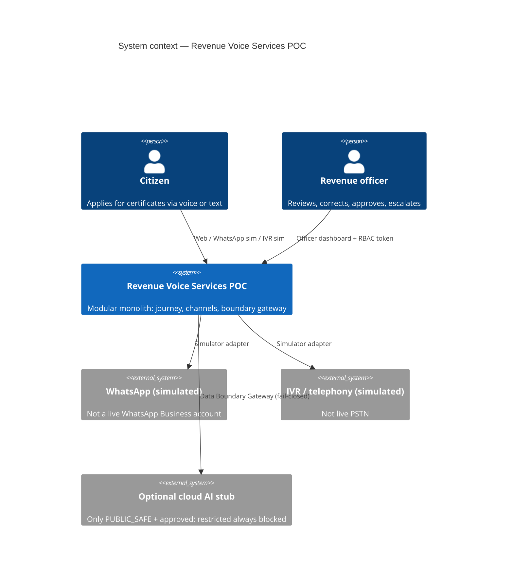

## C4 — Containers (modular monolith)

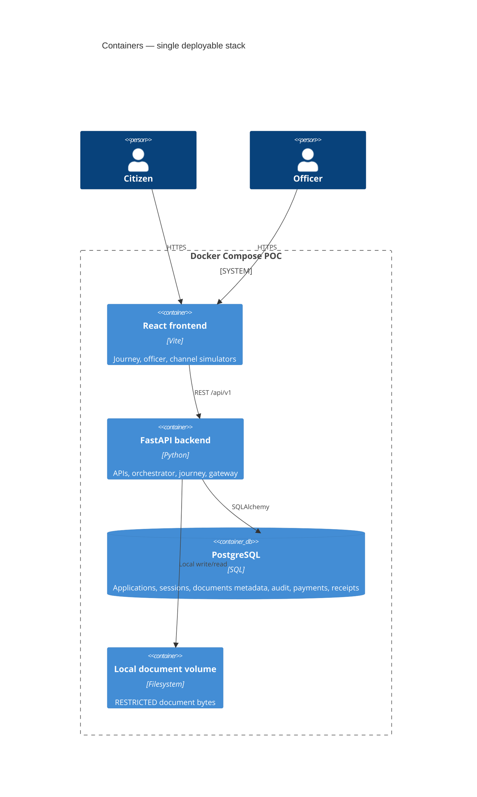

## Trust zones and data boundary

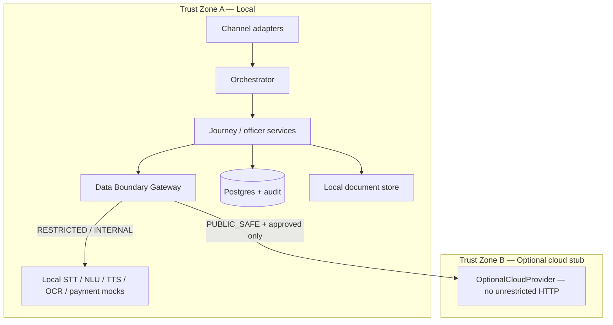

## Sequence — data-boundary deny (restricted → cloud)

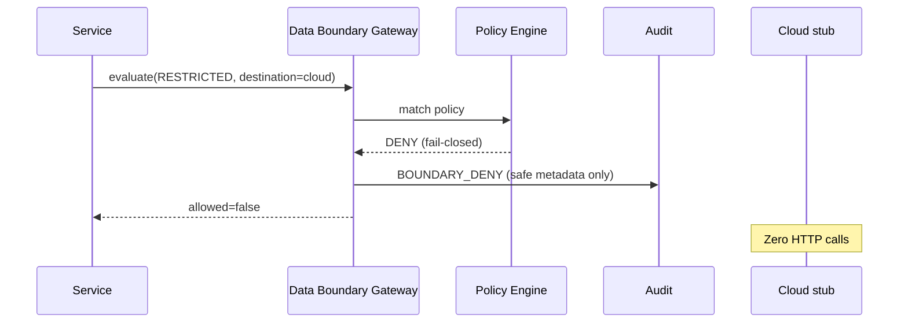

## Sequence — authentication and consent

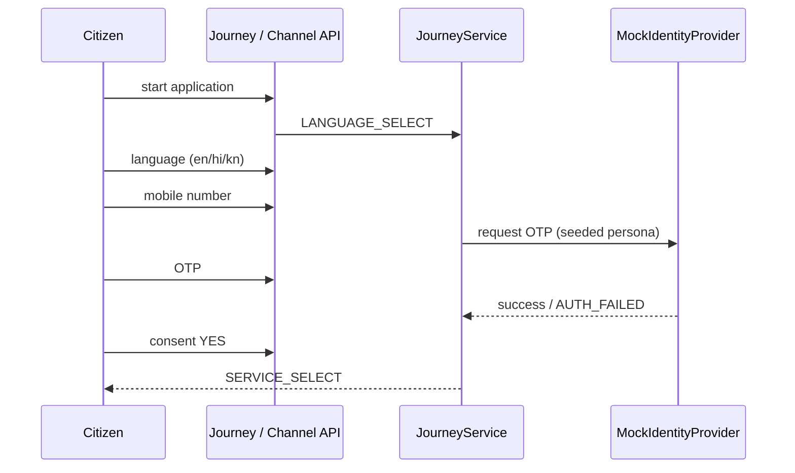

## Sequence — voice form capture (web)

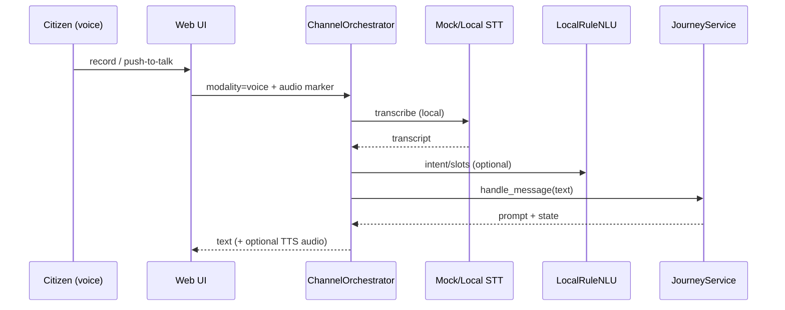

## Sequence — document verification

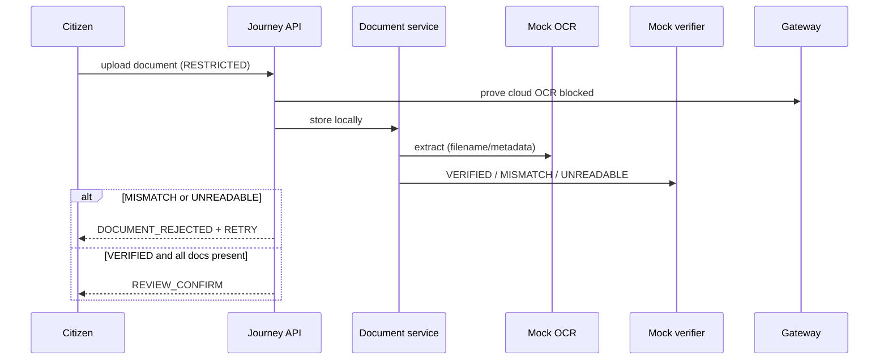

## Sequence — payment and failure recovery

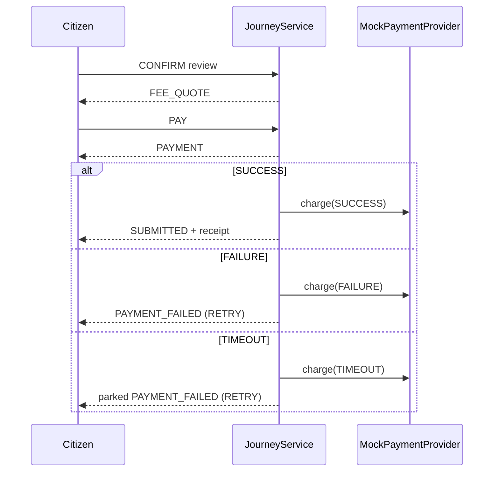

## Sequence — cross-channel resume

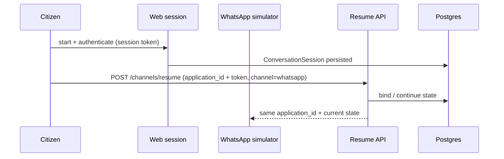

## Sequence — correction and officer escalation

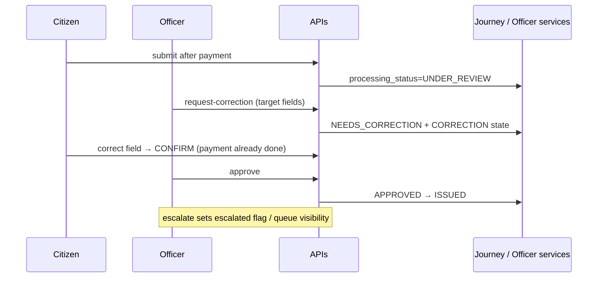

## Journey state machine (citizen conversational path)

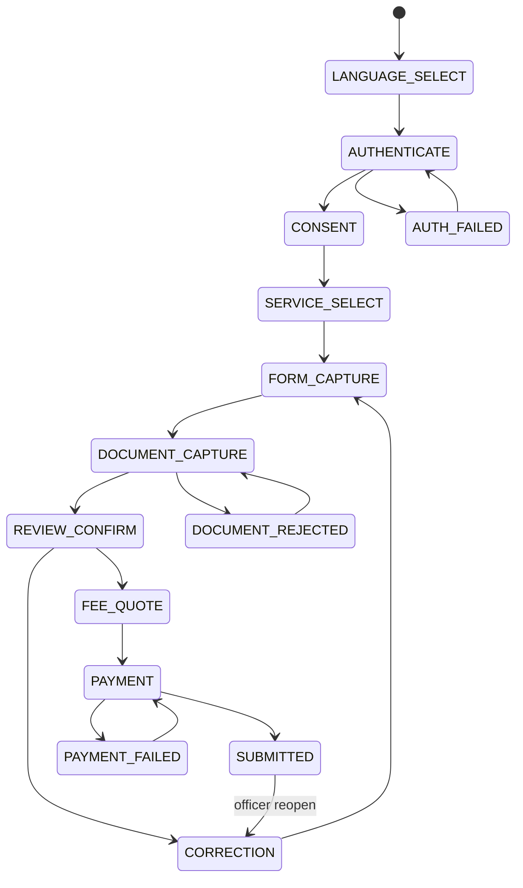
