# Architecture diagrams and key sequences

Hackathon POC — Multilingual Voice-First Revenue Services Platform.

Companion to [architecture.md](./architecture.md). Diagrams use Mermaid and reflect the **current codebase** (simulators, mock providers, local STT/TTS, shared Application identity).

## A. System context

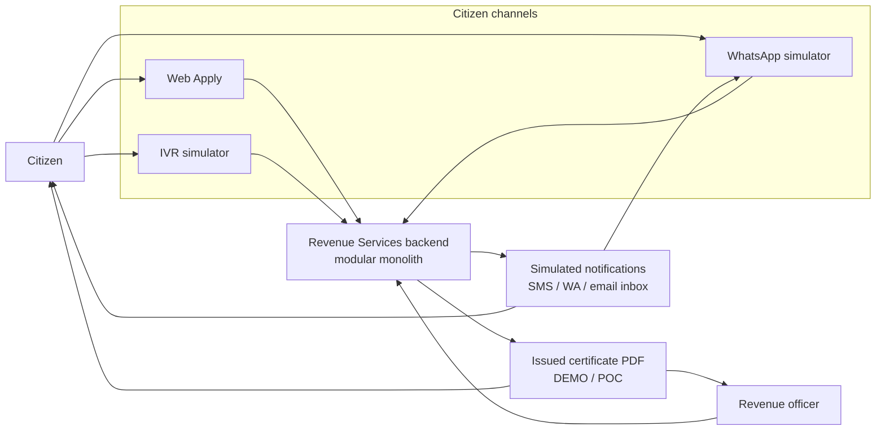

Notes: WhatsApp and IVR are **simulators**, not live Meta WhatsApp or PSTN. Notifications are **local/simulated**.

---

## B. Container architecture

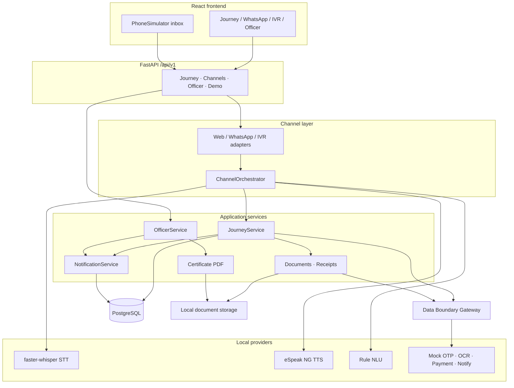

---

## C. Shared application journey

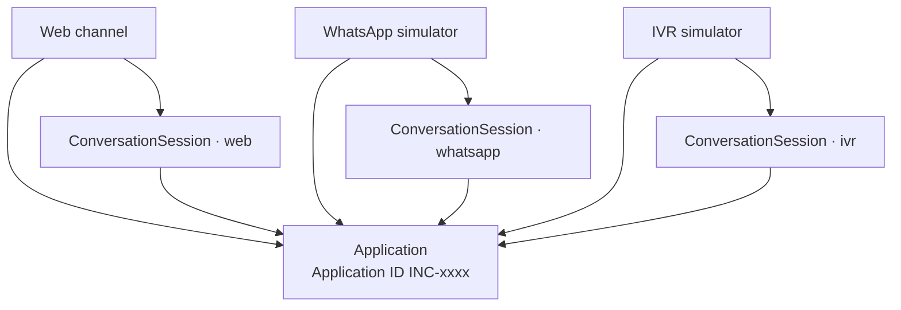

- **Start** creates one Application + first session.  
- **Resume** creates/uses a session for the target channel on the **same** Application.  
- Messages update shared journey state, form data, documents, and payment.

---

## D. Resume / handoff

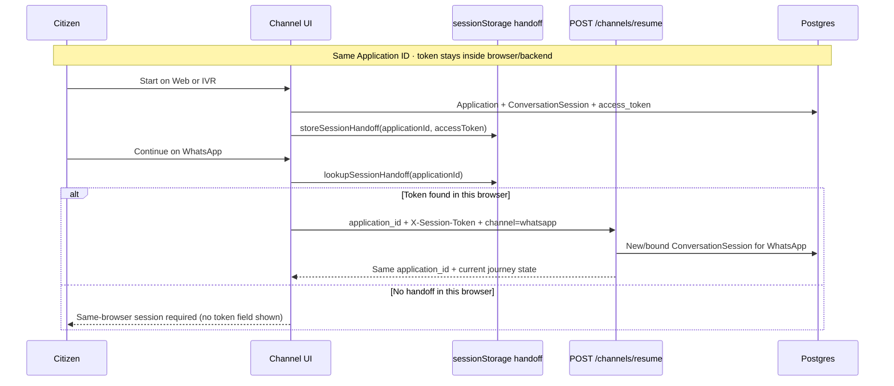

Application ID alone is **not** authentication. Cross-device resume without a prior token is **not** supported.

---

## E. IVR — DTMF and voice

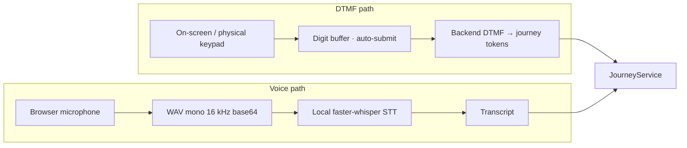

Field confirmation on IVR: **Press 1 = Confirm · Press 2 = Change** (not `#` / `*`).  
Menus (language, consent, register, service, pay) use single-digit DTMF. Mobile (10) and OTP (6) auto-submit when complete. Free-form fields use voice.

---

## F. Officer review

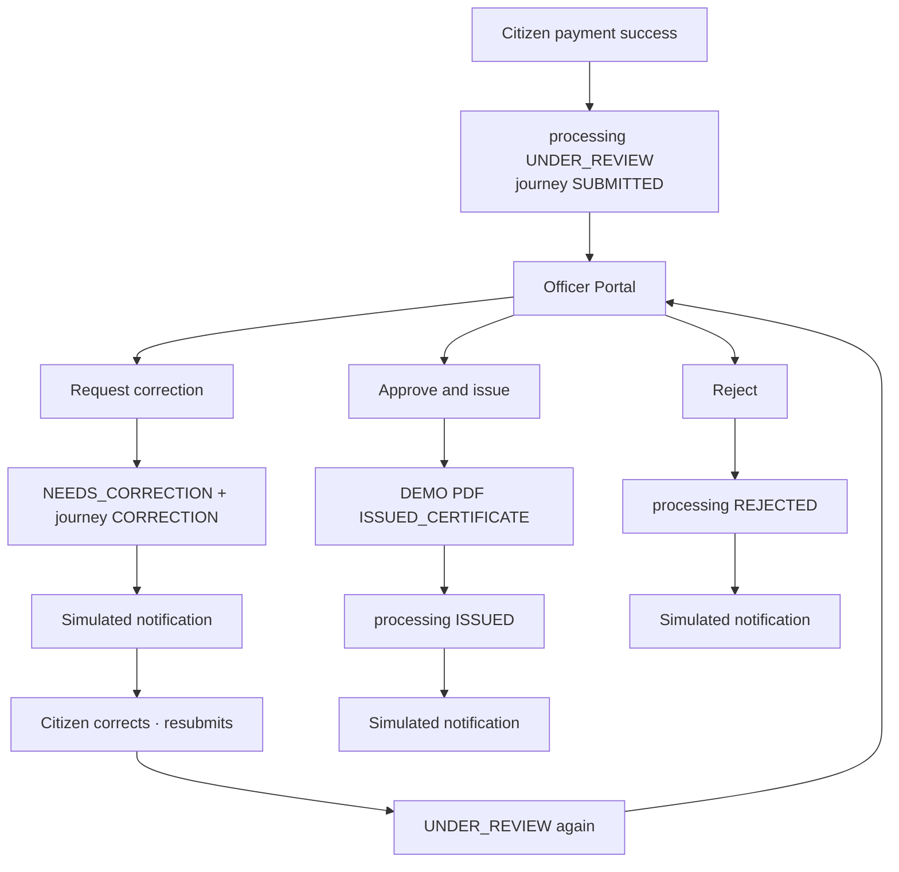

Escalate sets an escalated flag (and may move journey to `ESCALATED` when the state machine allows). The officer always acts on the **same** Application.

---

## G. Certificate issuance

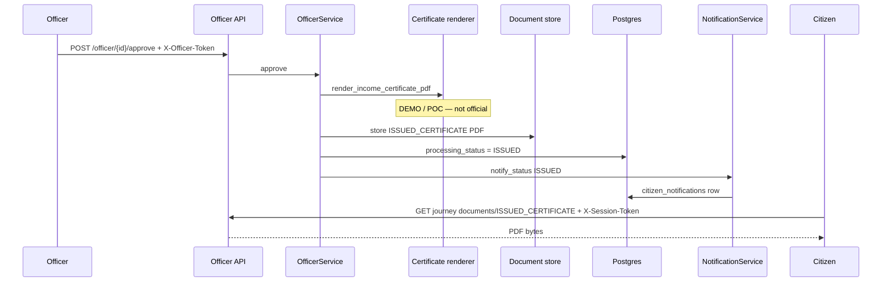

Re-approve when already `ISSUED` is idempotent (reuse PDF). Application ID alone cannot download.

---

## H. Notification flow

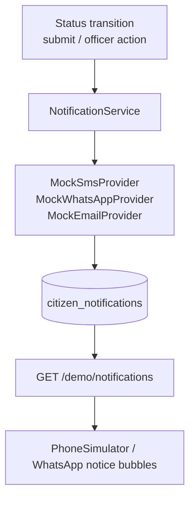

Events implemented: `SUBMITTED`, `UNDER_REVIEW`, `NEEDS_CORRECTION`, `ISSUED`, `REJECTED`.  
Delivery is **simulated** (`delivery_status=simulated`). Cycle-based deduplication skips repeats until a break event (`NEEDS_CORRECTION` / `ISSUED` / `REJECTED`).

---

## Trust zones and data boundary

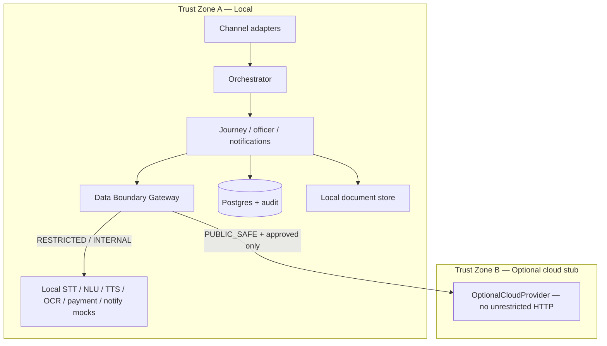

---

## Sequence — data-boundary deny (restricted → cloud)

---

## Sequence — authentication and consent

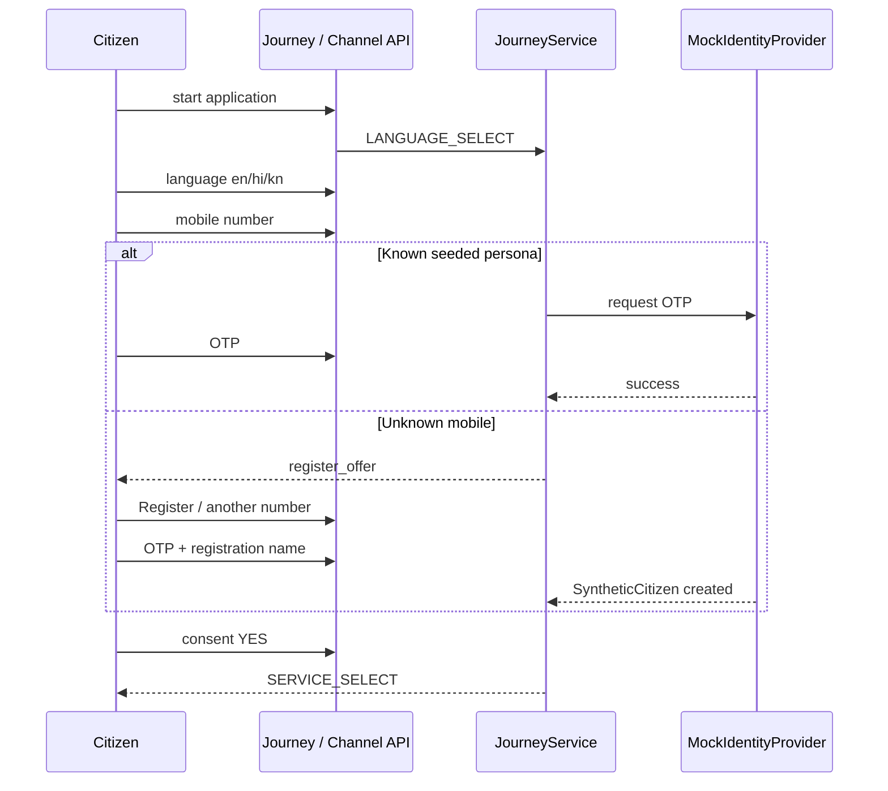

---

## Sequence — voice form capture (web)

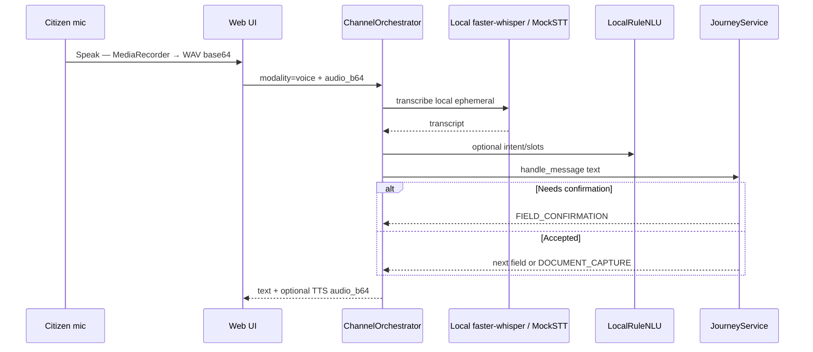

Audio is **not** stored durably after STT.

---

## Sequence — document verification

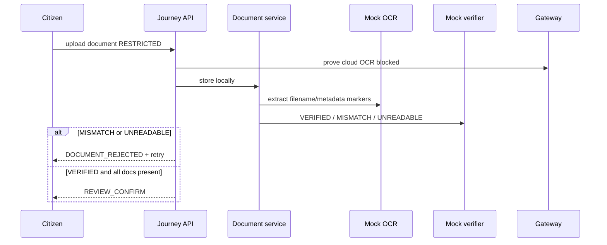

---

## Sequence — payment and failure recovery

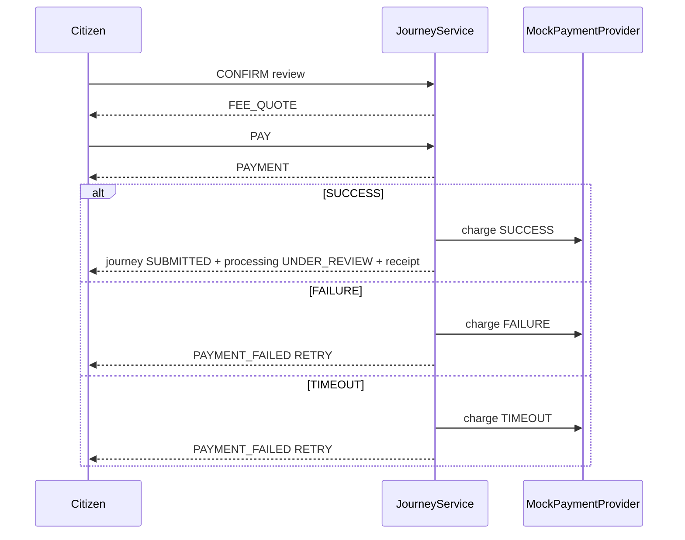

---

## Journey state machine (citizen conversational path)

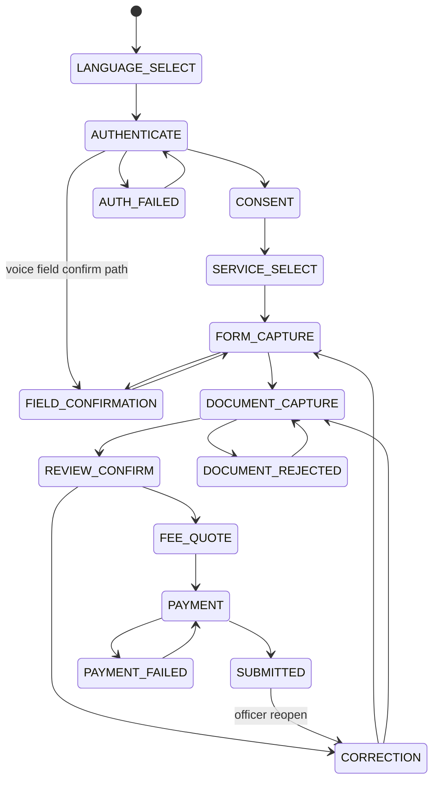

Processing after successful payment: **`UNDER_REVIEW`** (officer queue), then officer outcomes `NEEDS_CORRECTION` / `ISSUED` / `REJECTED`.
